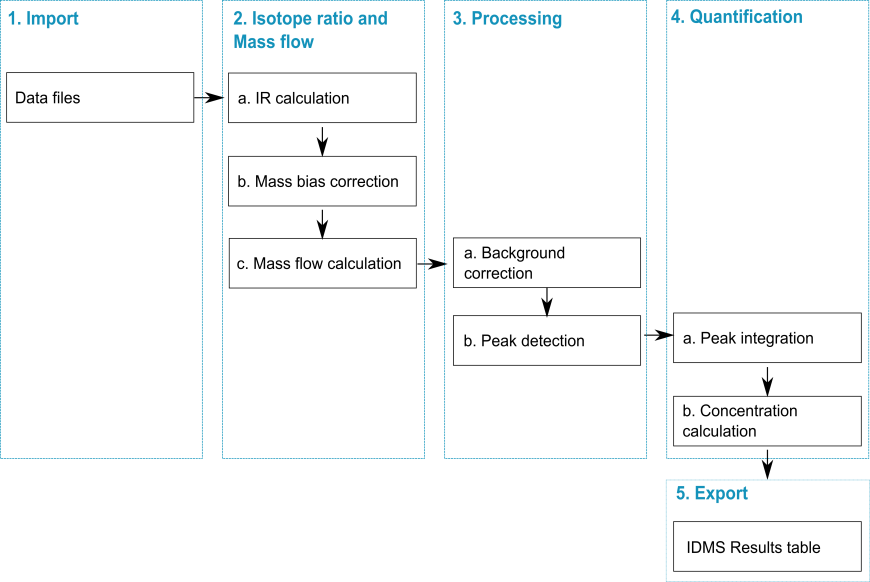

## General

#### The IsoCor application (App) performs calculation in two modes using transient signals:

(1) calculation of isotope ratio and delta, denoted as IR-Delta;

(2) calculation of mass flow for post-column isotope dilution quantification, denoted as IDMS.

The data processing workflow of each mode is done according to the schemes below:

1)  calculation of isotope ratio and delta (IR-Delta)

2)  calculation of mass flow (IDMS)

#### The application interface is divided into three main parts

part A: includes options for Data upload, Column selection and Processing\
part B: includes visualization options\
part C: includes output tables
