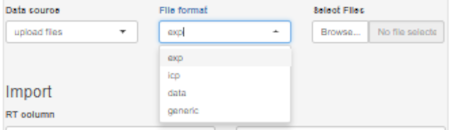

## File upload

### How to read in your data

The ***IsoCor*** App supports text files with different extensions (.exp, .csv, and .txt). 
Each data file should contain at least three columns, one for the separation run time duration and two more columns for the intensities of the two isotopes under investigation.

To upload file(s) select `upload files` on Data source drowdown menu. Select suitable option on `File format` dropdown menu.

***Note!*** 
When uploading several files (reproducibility/repeatability runs of the same sample), number of columns and column names must be similar in all files.
The simplest file format is `generic` (see example below).

### Explanation of the file format options

#### file format: exp

- tab-delimited file
- header row
- column 'Time' exists
- time unit in milliseconds (hh:mm:ss:xxx)
- n comment rows at end, all starting with at least one '*'

#### file format: icp

- tab-delimited file
- first column contains time in seconds
- 6 comment rows at top
- first row contains ion names,

#### file format: data

- csv file
- third column contains time in seconds
- first 2 columns get removed

#### file format: generic

- tab-delimited file
- header row expected
- at least 3 columns with numeric values expected

