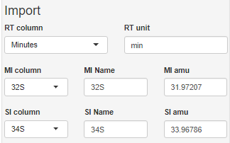

### Import parameters

A sucessful file import should lead to reasonable parameter settings automatically.
However, the user can apply the several modifications.

#### Abbreviations

| 
Abbr
 | 
Explanation
 | 
Effect
 | 
| :--- | :--- | :--- |
| RT      | retention time           | select the column to be used for the x axis |
|         |                          | specify the time `unit` shown in the plot   |
| MI, SI  | main (secondary) isotope | specify the two isotopes to be compared |
| amu     | atomic mass unit         | automatically obtained by ***IsoCor*** when contained in column names   |
|         |                          | alternatively specified by the user manually for *mass bias correction* |

The isotope ratio is calculated using formula: $IR=\frac{Intensity(SI)}{Intensity(MI)}$

After files are uploaded into IsoCor, the App reads column names, and shows them as a dropdown menu to make a selection for RT, MI, SI columns. 
The App calculates IR for one pair of isotopes at once. To perform calculation of isotope ratio for several pairs, the processing should be done separately.

Atomic weights of isotopes are written manually by the user. They are used for mass bias correction. 
If mass bias correction step is skipped, then amu placeholder can be left empty.
