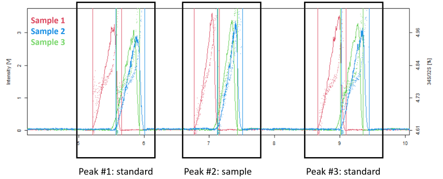

## Peak table

Peak table contains peak detection results and mass bias correction details

#### Explanation of the column names

-   *Sample*: ID of the sample; each file is indexed when several files are uploaded\
-   *Peak ID*: ID of the detected peaks (when several files are uploaded, the files should contain same number of peaks); each detected peak is indexed numerically\
-   *RT max*: retention time of the peak at maximum intensity\
-   *RT start*: retention time at the start of the peak\
-   *RT end*: retention time at the end of the peak\
-   *Scan start*: index of the row corresponding to the start of the peak\
-   *Scan end*: index of the row corresponding to the end of the peak\
-   *Scan length*: number of points corresponding to the peak elution from start to the end\
-   *Mass bias method*: Name of the method when mass bias correction is applied; default name "none"\
-   *f_value*: a coefficient for mass bias correction; the coefficient should be calculated separately and copy/pasted into IsoCor; find detailed explanation below\
-   *k*: mass bias correction factor calculated by the IsoCor; find detailed explanation below\
-   *Type*: Type of the peak: standard, sample or discard; type is selected by the user; find detailed explanation below

#### Explanation of the buttons located above the table

-   *Copy*: to copy the entire table\
-   *Excel*: to save the table as Excel file\
-   *define mass bias correction*: parameters for mass bias correction; find detailed explanation below\
-   *change peak type*: set peak type as standard or sample, or discard; find detailed explanation below

#### Explanation of the mass bias correction

IsoCor perfroms mass bias correction according to the formula:\
$IR_{corrected}=IR_{measured}*K$

The correction factor K can be calculated with one of three equations that is selected by the user:\
Linear equation:\
$K_{SI/MI}=1+f(amu_{SI}-amu_{MI})$

Russel's equation:\
$K_{SI/MI}=(amu_{SI}/amu_{MI})^f$

Exponential equation:\
$K_{SI/MI}=e^{f*(amu_{SI}-amu_{MI})}$

After mass bias correction method is selected, the f values should be copy/pasted onto the placeholder. Typically, f values are calculated from continuously introduced standard, thus number of f values should be same as number of peaks (for example 3 repetitions files, each file has 3 peaks; thus total 9 peaks need to have 9 corresponding f values). Atomic weights of the isotopes are also added by the user for MI and SI on Import section.\
Then correction factor K is calculated by the App, and isotope ratio values are updated according to mass bias correction. Manually added f values and app-calculated K values are shown in Peak table.

#### Explanation of the peak type

Each peak can be selected as either standard or sample or be discarded. The selection of peak type is needed for delta calculation with standard-sample bracketing method.

For example, if file has three peaks, then, typically, the 1st and 3rd peaks are standard, and middle peak is sample.

To set the type of the peak:\
1. click on one of the rows on Peak table\
2. click *change peak type* button\
3. select type of the peak from dropdown menu

After peak detection, each peak is indexed with a number. Peaks with same index are assigned with same type of peak. For example, when type of peak \#1 on sample \#1 is set to Standard, then peak \#1 in all samples are assigned as Standard. Similarly, if type of peak \#2 on sample \#1 is set to Sample, then peak \#1 in all samples are assigned as Sample. This is important to perform same calculation of delta in all samples.

***Note!***\
by default, when typical data with three peaks are uploaded, the first and third peaks are set to *standard*, and middle peak is set to *sample*. This default type can be changed following the steps described above. For delta calculation, the isotope ratio of standard is found by averaging isotope ratio values of first and third peaks.
